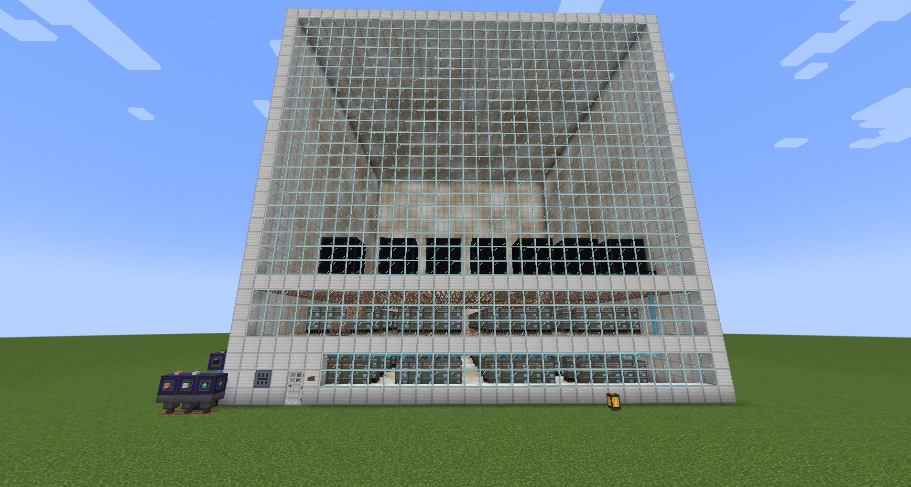

# LogiCore

-----

### Matter is just Data.

**LogiCore** allows you to digitize the physical world. By breaking down matter into its fundamental "Cycles," you can
store, manipulate, and reconstruct items at will. Unlike magic-based exchange mods, LogiCore requires industrial
infrastructure, power management, and data processing.

-----

## ⚡ Key Features

### 💾 The Cycle System

Every item in the world consists of data. LogiCore assigns a **Cycle Value** to items (similar to EMC).

- **Compiler:** The heart of your operation. It turns **Cycles** into any item that has a **Cycle** value attached to
  it.
- **Dynamic Calculation:** The system automatically calculates the value of complex crafted items based on their raw
  components.

-----

### 📦 Custom cycle values

You are able to modify cycles values by modifying the `config/logicore/custom_cycles.json` file.

```json
{
  "_comment": "Define custom cycle values here. Keys can be Item IDs (minecraft:cobblestone) or Tags (#minecraft:logs).",
  "values": {
	"minecraft:dirt": 256,
	"c:stones": 10
  }
}
```

By calling the `/reload` command it will refresh your cycle cache and update cycle values for all the items in the game.

-----

### 🏢 Modular Data Centers

Forget magical chests with infinite space. In LogiCore, you build physical infrastructure.

- **Multiblock Structures:** Construct custom-sized Data Centers using **Controllers**, **Ports**, and **Frames**.
- **Massive Storage:** Store billions of Cycles in a centralized network.
- **Sealed Systems:** Your Data Center must be a fully sealed, valid multiblock to function.

Datacenter consists of `Wall`, `Frame` and `Inner` blocks.

`Wall` blocks are any block that has a tag: `logicore:valid_datacenter_wall_block`.

`Frame` blocks are any block that has a tag: `logicore:valid_datacenter_frame_block`.

`Inner` blocks are any block that has a tag: `logicore:valid_datacenter_inner_block`.

### 🔌 Power & Processing

Data requires energy.

- **Server Racks:** High-density processing units that maintain your Cycle network.
- **Power Consumption:** Certain machines (Server rack, Computer) require **Forge Energy (FE)** to generate **Cycles**.
- **Generators:** Early-game power solutions to kickstart your digital empire.

### 🤖 Automation Drones

Deploy advanced AI entities to automate your world.

- **Drone Bays:** Deploy and recharge drones to handle tasks autonomously.

### 📚 In-Game Guide

Stuck? LogiCore includes a **Patchouli** guidebook and a **GuideME** guide, *"The Logic Index,"* which documents every
machine and mechanic.

-----

## 🛠️ Getting Started

1. **Generate Power:** Craft a **Generator** and fuel it to start producing FE.
2. **Computer:** Early game machine that slowly turns FE into Cycles.
3. **The Compiler:** It converts Cycles into items.
4. **Digitize:** Place simple items (Cobblestone, Dirt) into the Compiler to generate your first Cycles.
5. **Expand:** As your Cycle count grows, construct a **Data Center** (7x7x7 or larger) using a **Datacenter Controller
   ** and **Data Cables** to expand your storage cap.

-----

## 📸 Screenshots



-----

## 📦 Dependencies

* **Minecraft:** 1.21.1
* **NeoForge:** Latest recommended version.
* Optional dependencies / compatibilities:
    * **Patchouli**
    * **Jade**
    * **JEI** / **EMI**
    * **AE2**
        * **GuidMe**

-----

## 📜 License

This project is licensed under the [MIT License](LICENSE.md).

-----

### 🐛 Issues & Support

Found a bug? Have a feature request? Please report it on our [GitHub Issues](https://github.com/gigili/logicore/issues)
page.

Or join the discord server: [https://discord.gg/7maXVvt2c4](https://discord.gg/7maXVvt2c4)
